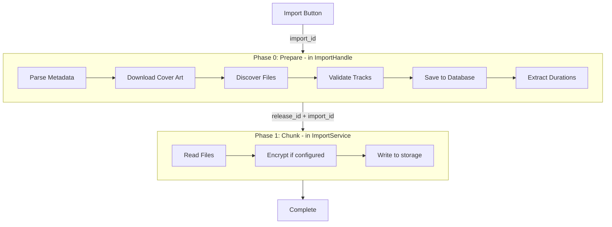

# Import Entity and Phase 0 Progress Roadmap

**Scope: Folder imports only** (torrent and CD imports excluded for now)

## Architecture Overview



**Note:** Folder imports use `run_storage_import` or `run_none_import` directly, not the streaming pipeline.

## Data Model

```rust
struct DbImport {
    id: String,                    // UUID, generated on button click
    status: ImportStatus,          // Preparing, Importing, Complete, Failed
    release_id: Option<String>,    // Linked after phase 0
    album_title: String,           // For display before release exists
    artist_name: String,
    folder_path: String,           // Source folder
    created_at: i64,
    updated_at: i64,
    error_message: Option<String>,
}

enum ImportStatus { Preparing, Importing, Complete, Failed }
```

---

## Plan 1: Database Schema and Import Entity

Add the `imports` table and basic CRUD operations.**Files:** [`bae/src/db/schema.rs`](bae/src/db/schema.rs), [`bae/src/db/client.rs`](bae/src/db/client.rs), [`bae/src/db/mod.rs`](bae/src/db/mod.rs)**Operations:** `insert_import`, `update_import_status`, `update_import_error`, `link_import_to_release`, `get_active_imports`, `get_import`---

## Plan 2: Progress Types and Subscription Infrastructure

Extend progress types to support import_id and phase 0 steps.**Files:** [`bae/src/import/types.rs`](bae/src/import/types.rs), [`bae/src/import/progress/handle.rs`](bae/src/import/progress/handle.rs)**New types:**

```rust
pub enum PrepareStep {
    ParsingMetadata,
    DownloadingCoverArt,
    DiscoveringFiles,
    ValidatingTracks,
    SavingToDatabase,
    ExtractingDurations,
}

pub enum ImportProgress {
    Preparing { import_id: String, step: PrepareStep },
    Started { id: String, import_id: Option<String> },
    Progress { id: String, percent: u8, phase: Option<ImportPhase>, import_id: Option<String> },
    Complete { id: String, release_id: Option<String>, cover_image_id: Option<String>, import_id: Option<String> },
    Failed { id: String, error: String, import_id: Option<String> },
}
```

**New subscription filter:** `SubscriptionFilter::Import { import_id }` matches Preparing events and any event with matching import_id.---

## Plan 3: Phase 0 Progress Emission

Update import handle to accept import_id and emit Preparing events.**Files:** [`bae/src/import/handle.rs`](bae/src/import/handle.rs)**Key change:** ImportHandle needs `progress_tx` (not just `progress_handle`) to emit events during phase 0.**Changes to `send_folder_request`:**

1. Accept `import_id: String` parameter
2. Create DbImport record at start
3. Emit `Preparing { import_id, step }` before each major step
4. Link import to release after DB insert
5. Update status to Importing when queuing command

---

## Plan 4: Service Integration

Pass import_id through command and include in progress events.**Files:** [`bae/src/import/types.rs`](bae/src/import/types.rs), [`bae/src/import/service.rs`](bae/src/import/service.rs)

- Add `import_id: String` to `ImportCommand::Folder`
- Include `import_id` in all Progress/Complete/Failed events
- Update import status on completion/failure

---

## Plan 5: Import Page UI

Subscribe to import progress and show phase 0 steps.**Files:** [`bae/src/ui/components/import/workflow/folder_import.rs`](bae/src/ui/components/import/workflow/folder_import.rs)**Flow:**

1. User clicks Import -> generate `import_id`
2. Subscribe via `import_service.subscribe_import(import_id)`
3. Display steps as Preparing events arrive