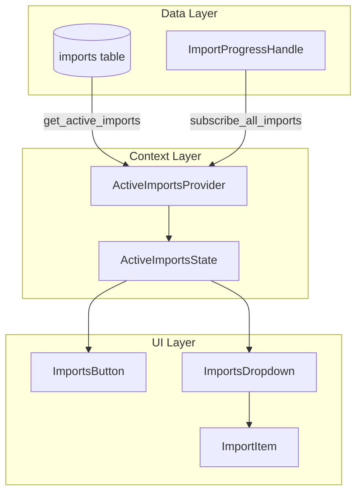
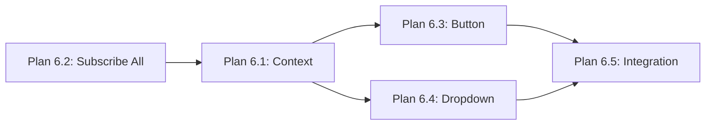

# Toolbar Imports Dropdown - Roadmap

## Goal

Add a dropdown button to the title bar that shows all active imports with their current status and progress. Users can see at a glance what's importing without navigating away from their current page.

## UI Mockup

```javascript
┌─────────────────────────────────────────────────────────────────┐
│ [Library] [Import] [Settings]     [↓ Imports (2)]    [Search]  │
└─────────────────────────────────────────────────────────────────┘
                                          │
                                          ▼
                         ┌────────────────────────────────┐
                         │ Active Imports                 │
                         ├────────────────────────────────┤
                         │ Radiohead - OK Computer        │
                         │ Downloading cover art...       │
                         │ ████████░░░░░░░░ 45%          │
                         ├────────────────────────────────┤
                         │ Pink Floyd - DSOTM             │
                         │ Saving to database...          │
                         │ ██████████████░░ 90%          │
                         └────────────────────────────────┘
```


## Architecture



---

## Plan 6.1: Active Imports Context Provider

Create a context that manages the list of active imports and their progress.**New file:** [`bae/src/ui/components/active_imports_context.rs`](bae/src/ui/components/active_imports_context.rs)**State:**

```rust
struct ActiveImport {
    import_id: String,
    album_title: String,
    artist_name: String,
    status: ImportOperationStatus,
    current_step: Option<PrepareStep>,
    progress_percent: Option<u8>,
}

struct ActiveImportsState {
    imports: Signal<Vec<ActiveImport>>,
    is_loading: Signal<bool>,
}
```

**Responsibilities:**

- Load active imports from DB on mount
- Subscribe to progress events (needs new `subscribe_all_imports` method)
- Update state when `Preparing`, `Progress`, `Complete`, `Failed` events arrive
- Remove completed/failed imports after brief delay (or keep for history)

**Dependency:** Needs `subscribe_all_imports()` in `ImportProgressHandle`---

## Plan 6.2: Subscribe All Imports Method

Add ability to subscribe to progress for ALL imports (not filtered by ID).**File:** [`bae/src/import/progress/handle.rs`](bae/src/import/progress/handle.rs)**New filter variant:**

```rust
enum SubscriptionFilter {
    Release { release_id: String },
    Track { track_id: String },
    Import { import_id: String },
    AllImports,  // NEW - matches any event with import_id
}
```

**New method:**

```rust
pub fn subscribe_all_imports(&self) -> UnboundedReceiver<ImportProgress>
```

---

## Plan 6.3: Imports Button Component

Create the toolbar button that shows import count and toggles dropdown.**New file:** [`bae/src/ui/components/imports_button.rs`](bae/src/ui/components/imports_button.rs)**Features:**

- Show count badge when imports > 0
- Animated spinner when any import is active
- Click to toggle dropdown
- Hide when no imports

---

## Plan 6.4: Imports Dropdown Component

Create the dropdown list showing active imports.**New file:** [`bae/src/ui/components/imports_dropdown.rs`](bae/src/ui/components/imports_dropdown.rs)**Features:**

- List of active imports
- Each item shows: artist - album, current step/status, progress bar
- Click item to navigate to album (if Complete) or import page
- Click-outside to close
- Empty state: "No active imports"

---

## Plan 6.5: Title Bar Integration

Wire up the imports button and dropdown into the title bar.**File:** [`bae/src/ui/components/title_bar.rs`](bae/src/ui/components/title_bar.rs)**Changes:**

- Add `ActiveImportsProvider` wrapper or use from parent
- Add `ImportsButton` between nav buttons and search
- Position dropdown below button

---

## Dependencies




## Order of Implementation

1. **Plan 6.2** - Add `subscribe_all_imports` method (small, enables everything else)
2. **Plan 6.1** - Create context provider (core state management)