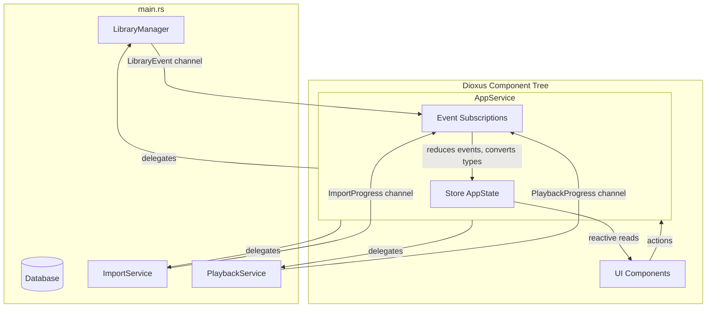

# AppService Architecture



## Key Concepts

**Backend services** (LibraryManager, ImportService, PlaybackService) are created in `main.rs`. They are `Send + Sync` and run background tasks.

**AppService** is created inside the Dioxus component tree. It owns the Store and is NOT `Send + Sync`.

**Data flow:**
1. AppService subscribes to all backend event channels
2. AppService reduces events and updates Store (DbAlbum → Album conversion happens here)
3. UI components read Store reactively, call AppService methods for actions
4. No event handling or type conversion in UI—purely reactive

## AppService Structure

```rust
pub struct AppService {
    /// Reactive state - owned by AppService
    pub state: Store<AppState>,
    
    /// Backend service handles (for delegating actions)
    library_manager: SharedLibraryManager,
    import_handle: import::ImportServiceHandle,
    playback_handle: playback::PlaybackHandle,
    // ... other handles
}

impl AppService {
    /// Create AppService and start event subscriptions
    pub fn new(services: &AppServices) -> Self { ... }
    
    /// Start all event subscription loops (called once after creation)
    pub fn start_subscriptions(&self) { ... }
    
    // --- Action methods (delegate to backend services) ---
    pub fn play_album(&self, track_ids: Vec<String>) { ... }
    pub fn delete_album(&self, album_id: &str) { ... }
    // ... etc
}
```

## App Component

The App component is minimal—it just creates and provides AppService:

```rust
#[component]
pub fn App() -> Element {
    let services = use_context::<AppServices>();
    let app_service = AppService::new(&services);
    app_service.start_subscriptions();
    use_context_provider(|| app_service);
    
    rsx! {
        // ... stylesheets, router
    }
}
```

## UI Component Pattern

UI components access state and trigger actions through AppService:

```rust
fn SomeComponent() -> Element {
    let app = use_app_service();
    
    // Read state reactively
    let albums = app.state.library().albums();
    
    // Trigger actions
    let on_play = move |_| app.play_album(track_ids.clone());
    
    rsx! { ... }
}
```

## Key Files

- `bae-desktop/src/ui/app_service.rs` — AppService struct with all logic
- `bae-desktop/src/ui/app_context.rs` — AppServices (Send+Sync backend handles from main.rs)
- `bae-desktop/src/ui/components/app.rs` — minimal App component that creates AppService
